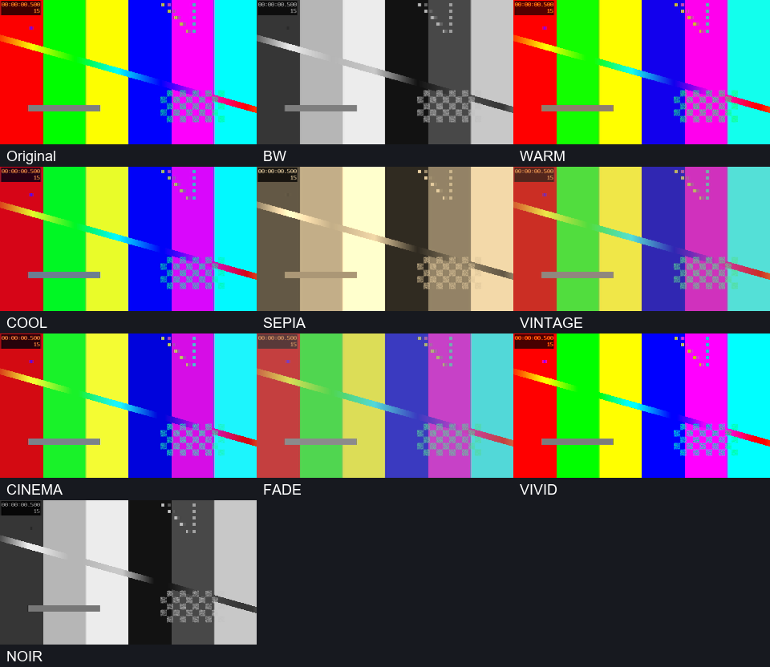

# PixelCut — ربات خصوصی ویرایش ویدیو

ربات فقط پیام و دکمه‌های **یک ادمین با شناسهٔ عددی مشخص، در چت خصوصی** را پردازش می‌کند. به دیگران حتی پیام عدم دسترسی نمی‌فرستد. تمام ویرایش‌ها در یک گراف FFmpeg انجام می‌شود؛ حالت پیش‌فرض دو گذر تحلیل و encode نهایی دارد و خروجی‌های میانی دوباره فشرده نمی‌شوند. MoviePy وابستگی پروژه نیست.

**مسیر سریع:** ویدیو را بفرستید، متن یا لوگو و کلیپ‌های دلخواه را انتخاب کنید، سپس «ساخت خروجی» را بزنید. منوی اصلی شش ردیف است؛ تنظیمات جزئی در «گزینه‌های بیشتر» قرار دارند. خروجی پیش‌فرض **حجم متناسب با ورودی** است: فشرده‌سازی دو مرحله‌ای بر اساس نرخ واقعی ویدیو، با حفظ ابعاد، تعداد و زمان‌بندی فریم در واترمارک ساده و صدای دست‌نخورده. این حالت تصویر را بازفشرده می‌کند و Lossless نیست. قالب MP4 یا MKV برای حفظ صدا انتخاب می‌شود. اتصال پیش‌فرض **ساده** است تا FPS خودکار تبدیل نشود.

## امکانات

- منوی فارسی با دکمه‌های شیشه‌ای بعد از دریافت ویدیو.
- متن فارسی/عربی/لاتین؛ رنگ سفید، سیاه یا داینامیک بر اساس روشنایی زیر متن در هر فریم.
- فیلتر رنگی B&W، گرم، سرد، سپیا، وینتیج، سینمایی، مات، رنگ زنده و نوآر؛ شدت قابل تنظیم.
- اصلاح روشنایی، کنتراست، اشباع، گاما، دمای رنگ و تیرگی لبه‌ها؛ بازنشانی مستقل رنگ.
- مقایسهٔ فیلترها روی یک فریم مشترک، پشتیبانی از LUT سه‌بعدی `.cube` و اتصال مرجع به DNT1 تا DNT5.
- لوگوی شفاف؛ اندازهٔ درصدی، ۹ موقعیت، حاشیه و شفافیت مستقل برای متن و لوگو.
- کلیپ ابتدا و انتها؛ آپلود هنگام ویرایش یا انتخاب از کتابخانهٔ سرور.
- ترنزیشن مستقل ابتدا/انتها: سایه، محو نرم، حل شدن، حرکت نرم به چپ، دایره و پیکسلی؛ همچنین اتصال ساده.
- مدت قابل تنظیم ترنزیشن، محدود شدن خودکار برای کلیپ کوتاه، crossfade صدا و سکوت برای کلیپ فاقد صدا.
- آپلود و اعتبارسنجی TTF/OTF، نگهداری دائمی فونت و انتخاب آن هنگام ویرایش.
- پیش‌فرض‌ها، متن قابل استفادهٔ مجدد، برش زمانی، حذف صدا و تاریخچه.
- پیش‌نمایش کوتاه: حداکثر ۸ ثانیه از بخش انتخاب‌شدهٔ ویدیوی اصلی و ۳ ثانیه از هر کلیپ ابتدا/انتها.
- تبدیل کل ویدیوی اصلی یا بازهٔ زمانی دلخواه به GIF با ابعاد اصلی و پالت رنگ مستقل برای هر فریم.
- حجم متناسب با ورودی با H.264 / HEVC و کنترل سقف؛ گزینه‌های صریح کیفیت بالا، سریع یا encode بدون اتلاف با H.264 lossless / FFV1؛ ارسال فایل یا ویدیوی قابل پخش.
- پیشرفت دریافت/رندر/ارسال، لغو، تلاش دوباره و بازیابی پروژه پس از restart.
- حذف فایل کتابخانه با تأیید؛ جلوگیری از حذف فایل انتخاب‌شده در پروژه یا پیش‌فرض.

«سایه» یک گذار نرم از سیاه با `fadeblack` است؛ بازسازی دقیق افکت اختصاصی InShot نیست. اندازهٔ N٪ یعنی **عرض کل متن/لوگو** نسبت به عرض تصویر؛ نه ارتفاع فونت یا مساحت تصویر. اگر فضای عمودی کم باشد، کوچک‌تر می‌شود. رنگ اصلی لوگو حفظ می‌شود.

نمونهٔ شش ترنزیشن در [examples/transition-demo.mp4](examples/transition-demo.mp4) است. برای ساخت دوباره: `python scripts/make_demo.py`.

## نصب و اجرا

Python 3.11+ و FFmpeg/FFprobe با `libx264`، `libx264rgb`، `libx265`، `ffv1`، `wavpack` و فیلترهای `xfade`/`alphamerge` لازم است. توسعه روی Python 3.14 و FFmpeg 9.0.2 در Windows آزمایش شده است. هر دو ابزار باید در PATH باشند یا مسیرشان در `.env` تنظیم شود.

```powershell
python -m venv .venv
.\.venv\Scripts\python.exe -m pip install -e ".[dev]"
Copy-Item .env.example .env
```

اگر `.env` موجود است آن را ویرایش کنید و بازنویسی نکنید. این چهار مقدار را تنظیم کنید:

```dotenv
TELEGRAM_API_ID=your_numeric_api_id
TELEGRAM_API_HASH=your_api_hash
TELEGRAM_BOT_TOKEN=your_new_bot_token
TELEGRAM_ADMIN_ID=your_numeric_user_id
```

API ID و hash از [my.telegram.org](https://my.telegram.org) و توکن از BotFather دریافت می‌شود. ADMIN_ID شناسهٔ **کاربر انسانی ادمین** است، نه شناسهٔ ربات یا username. اگر شناسه را ندارید، با یک ابزار مورد اعتماد یا `get_me().id` در session حساب شخصی Telethon آن را بخوانید. ربات به کاربران ناشناس برای گرفتن شناسه پاسخ نمی‌دهد.

در این workspace ابزارهای تست داخل `.tools/ffmpeg-9.0.2-essentials_build/bin/` هستند و `.env` محلی مسیر آن‌ها را دارد. روی سرور مسیر همان سیستم را بدهید. فونت پیش‌فرض از Arial در Windows یا DejaVu Sans در Linux پیدا می‌شود؛ در غیر این صورت `DEFAULT_FONT_PATH` بدهید یا فونت آپلود کنید. اعتبار فونت بررسی می‌شود ولی پوشش حروف هر زبان به فونت بستگی دارد.

```powershell
.\.venv\Scripts\python.exe main.py --check
.\.venv\Scripts\python.exe main.py
```

`--check` ابزارهای رسانه و فونت را بدون ورود به Telegram بررسی می‌کند. برای شروع ربات چهار مقدار Telegram ضروری‌اند. ابتدا در چت خصوصی `/start` را بزنید و ویدیو بفرستید. اطلاعات حساس در سورس قرار نمی‌گیرند و `.env`، session و داده‌ها از Git/Docker build حذف شده‌اند.

## روال استفاده

1. ویدیوی اصلی را ترجیحاً با **Send as file** بفرستید؛ افت کیفیتی که پیش از دریافت ربات رخ داده قابل بازسازی نیست.
2. متن، لوگو و کلیپ ابتدا/انتها را انتخاب کنید. بخش کلیپ امکان آپلود همان لحظه را دارد و فایل را در کتابخانه هم نگه می‌دارد.
3. رنگ، درصد عرض، موقعیت، فونت، حاشیه و میزان نمایش را تغییر دهید یا «استفاده از پیش‌فرض» را بزنید. اندازه و مدت با چند مقدار آماده هم قابل انتخاب‌اند.
4. حالت پیشنهادی «حجم متناسب با ورودی» از ابتدا فعال است؛ تغییر آن در «حجم و کیفیت خروجی» ممکن است. برای ترنزیشن، مدت، برش، صدا و نوع خروجی به «گزینه‌های بیشتر» بروید؛ سپس پیش‌نمایش یا «ساخت خروجی» را بزنید.
5. پروژه برای تغییر و رندر دوباره باز می‌ماند. برای پروژهٔ جدید «ویدیوی جدید» را بزنید.

`/settings` پیش‌فرض‌ها، `/fonts` فونت‌ها، `/library` فایل‌ها، `/status` وضعیت، `/help` راهنما. دکمهٔ توقف دریافت/رندر یا `/cancel` عملیات را لغو و پروژه را حفظ می‌کند. حذف پروژه فقط با «ویدیوی جدید» انجام می‌شود. پس از زدن کلیپ ابتدا/انتها یا لوگو، می‌توانید مستقیم فایل جدید بفرستید یا فایل ذخیره‌شده را انتخاب کنید.

پیش‌فرض فقط ظاهر متن/لوگو، فونت، فیلتر و اصلاح رنگ، ترنزیشن‌ها، کیفیت و نوع ارسال را ذخیره می‌کند. **متن، فایل لوگو، ابتدا/انتها، برش و بی‌صدا بودن** خودکار وارد پروژهٔ جدید نمی‌شوند. متن تکراری را جداگانه در منوی اصلی ذخیره و هر بار با «متن ذخیره‌شده» اعمال کنید. هنگام ورودی متن/برش، `-` انتخاب را حذف می‌کند.

## فیلتر و اصلاح رنگ

بعد از ارسال ویدیو، «فیلتر رنگی» را در منوی اصلی بزنید. B&W خاکستری استاندارد است؛ گرم، سرد، سپیا، وینتیج، سینمایی، مات، رنگ زنده و نوآر **لوک‌های محلی PixelCut** هستند. فرمول‌ها در `movie_editor/media/grading.py` مشخص و قابل بازبینی‌اند و از کد Picsart استخراج نشده‌اند.

«شدت فیلتر» بین صفر و ۱۰۰ است. «اصلاح رنگ» تنظیمات مستقل روشنایی، کنتراست، اشباع، گاما، گرمی/سردی و تیرگی لبه‌ها را دارد؛ مقدارهای آماده یا عدد دلخواه قابل انتخاب است. با «بازنشانی رنگ» همهٔ این تنظیمات خنثی می‌شوند. شدت صفر فقط خود فیلتر را کنار می‌گذارد؛ اصلاحات دستی مستقل باقی می‌مانند. انتخاب «بدون فیلتر» هم اصلاحات دستی را حفظ می‌کند.

«پیش‌نمایش ویدیو» ظاهر انتخاب فعلی را نشان می‌دهد. «مقایسهٔ فیلترها» یک تصویر از همان فریم ویدیوی شما برای همهٔ لوک‌ها می‌سازد؛ فقط این تصویر نمونه کوچک شده است. فیلتر در رندر اصلی بعد از اتصال کلیپ‌ها و قبل از واترمارک/لوگو اعمال می‌شود، بنابراین رنگ لوگو با فیلتر تغییر نمی‌کند. تنظیمات رنگ و LUT انتخابی نیز همراه سایر تنظیمات در پیش‌فرض قابل ذخیره‌اند. پیش‌فرض‌ها و پروژه‌های نسخهٔ قبلی بدون از دست دادن انتخاب‌ها خوانده می‌شوند.



نمونهٔ بالا با `python scripts/make_filter_demo.py` قابل بازتولید است؛ این تصویر نمونهٔ Picsart نیست.

### مرجع دقیق DNT و LUT شخصی

**LUT رسمی DNT1 تا DNT5 در پروژه موجود نیست و تطبیق با Picsart هنوز تأیید نشده است.** این نام‌ها محل اتصال مرجع هستند؛ انتخاب DNT بدون مرجع، کتابخانهٔ LUT را باز می‌کند و افکت حدسی نمی‌سازد. برای اتصال یا تعویض مرجع: «مراجع DNT / LUT» ← نام DNT ← آپلود یا انتخاب فایل `.cube` همان فیلتر. پس از اتصال، انتخاب DNT از همان فایل استفاده می‌کند و مرجع بعد از restart هم می‌ماند. بخش «LUT شخصی» برای سایر پروفایل‌هاست.

فقط CUBE سه‌بعدی با اندازهٔ ۲ تا ۶۵، دقیقاً `size³` نمونه و اعداد RGB محدود به صفر تا یک پذیرفته می‌شود. CUBE یک‌بعدی و هدر/دامنهٔ ناسازگار رد می‌شود. حد حجم مستقل `MAX_LUT_MB` به‌طور پیش‌فرض ۲۰ MiB است. فایل در کتابخانهٔ سرور نگه‌داری می‌شود و حذف مرجع فعال پروژه/پیش‌فرض ممنوع است. حذف LUT غیرفعال، اتصال‌های مربوط به همان فایل را هم پاک می‌کند.

LUT با interpolation تتراهدرال اعمال می‌شود؛ شدت آن با ترکیب تصویر اصلی و تصویر فیلترشده کنترل می‌شود. LUT فقط نگاشت رنگ را توصیف می‌کند و افکت دارای بافت، blur یا عملیات مکانی را به‌تنهایی بازسازی نمی‌کند. داشتن نام DNT روی یک فایل، اصالت یا تطبیق دقیق آن با Picsart را ثابت نمی‌کند؛ برای تأیید تطبیق باید LUT/فرمول واقعی یا نمونهٔ مرجع معتبر در دسترس باشد. [مستندات LUT و فیلترهای FFmpeg](https://ffmpeg.org/ffmpeg-filters.html#lut3d)

## تبدیل به GIF

در منوی اصلی «تبدیل به GIF» را بزنید؛ سپس **کل ویدیو** یا **انتخاب بازهٔ زمانی** را انتخاب کنید. برای بازه، شروع و پایان را به ثانیه بفرستید؛ `12 20`، `۱۲ تا ۲۰` و `۱٫۵ تا ۲٫۲۵` معتبرند. پایان باید بعد از شروع و داخل مدت ویدیو باشد. انتخاب از فریمِ شروع تا پیش از پایان انجام می‌شود و مرزها به فریم‌های واقعی ویدیو وابسته‌اند.

مبدأ این ابزار **ویدیوی اصلیِ آپلودشده** است. تنظیمات واترمارک، لوگو، کلیپ ابتدا/انتها و برشِ پروژه روی این تبدیل اعمال نمی‌شوند؛ انتخاب بازهٔ GIF مستقل است و پروژهٔ ویرایش را تغییر نمی‌دهد. خروجی یک فایل واقعی `.gif` با تکرار نامحدود و بدون صدا است و به‌صورت Document ارسال می‌شود.

ابعاد خودکار کوچک نمی‌شود و فیلتر کاهش FPS وجود ندارد. برای هر فریم پالت جداگانهٔ حداکثر ۲۵۶ رنگ با `palettegen=stats_mode=single` و `paletteuse=new=1` ساخته می‌شود و dithering از نوع Sierra استفاده می‌شود. تبدیل مستقیم از منبع انجام می‌شود؛ ابتدا فایل MP4 با اتلاف ساخته نمی‌شود و کل ویدیو برای تولید پالت در حافظه نگه داشته نمی‌شود. [مستندات پالت FFmpeg](https://ffmpeg.org/ffmpeg-filters.html#palettegen)

**GIF معادل کیفیت بدون اتلاف ویدیو نیست:** هر فریم حداکثر ۲۵۶ رنگ دارد و زمان‌بندی در واحد یک‌صدم ثانیه است؛ بعضی پخش‌کننده‌ها تأخیرهای خیلی کوتاه را بیشتر می‌کنند. ورودی بالای ۱۰۰ FPS صریح رد می‌شود تا کاهش نرخ فریم خودکار رخ ندهد. در تبدیل کل ویدیو، تعداد فریم‌ها هم کنترل می‌شود. [مشخصات GIF89a](https://www.w3.org/Graphics/GIF/spec-gif89a.txt)، [زمان‌بندی GIF در FFmpeg](https://ffmpeg.org/ffmpeg-formats.html#gif)

کل فیلم در محدودهٔ `MAX_VIDEO_SECONDS` قابل تبدیل است؛ حجم GIF طولانی می‌تواند بسیار زیاد شود. حد حجم ارسال، فضای دیسک و مهلت تبدیل همان تنظیمات `.env` هستند. اگر حدی رد شود، تبدیل متوقف می‌شود و کیفیت یا اندازه خودکار کم نمی‌شود. پیشرفت، دکمهٔ توقف و `/cancel` در تبدیل و ارسال فعال‌اند؛ پس از ارسال، خطا یا لغو، خروجی بزرگ موقت پاک و پروژه حفظ می‌شود.

## کیفیت و نرخ فریم

| حالت | رفتار |
|---|---|
| واترمارک/لوگو بدون ترنزیشن | `-fps_mode passthrough`، بدون `fps` و `-r` اجباری؛ حفظ فاصلهٔ زمانی فریم‌ها، از جمله VFR |
| اتصال ساده | concat با زمان‌بندی متغیر؛ FPS متفاوت کلیپ‌ها اجباری یکسان نمی‌شود |
| ترنزیشن متحرک | تبدیل همهٔ کلیپ‌ها به FPS میانگین ویدیوی اصلی؛ در ورودی‌های متفاوت/VFR تکرار یا حذف فریم ممکن است |
| ابعاد | اندازهٔ نمایش ویدیوی اصلی حفظ می‌شود؛ ابعاد فرد با حداکثر یک پیکسل padding زوج می‌شود؛ ابتدا/انتها با حفظ نسبت و حاشیهٔ سیاه جا می‌گیرند |
| صدا | در تک‌کلیپ کامل، صوت سازگار کپی یا بدون فشرده‌سازی با اتلاف ذخیره می‌شود؛ در برش، اتصال و preview کوتاه، نمونه‌ها با دقت double پردازش و در PCM 64-bit float / MKV ذخیره می‌شوند؛ AAC مجدد ساخته نمی‌شود |
| حجم متناسب با ورودی (پیش‌فرض) | دو گذر با نرخ واقعی packetهای ویدیوی ورودی، ۵٪ بودجهٔ اضافه و ۸ KiB برای متن/فریم‌های کلیدی؛ حداقل ۱۵ kbit/s برای کلیپ‌های خیلی ساده. ورودی HEVC با `libx265` و بقیه با `libx264` ساخته می‌شوند؛ preset slow و حفظ YUV اصلی برای YUV420/422/444. تصویر با اتلاف بازفشرده می‌شود |
| بالا | H.264، CRF 17، slow، 8-bit YUV420p؛ فشرده‌سازی با اتلاف |
| سریع | H.264، CRF 20، veryfast |
| Lossless (انتخاب صریح، حجم خیلی زیاد) | H.264 با CRF 0 و preset slow برای YUV420/422/444؛ حفظ نمونه‌های رنگ اصلی بدون تبدیل سراسری به RGB. در تک‌کلیپ MP4 با صوت AAC/MP3/ALAC قابل کپی، MP4 و در سایر موارد MKV ساخته می‌شود. برای RGB/فیلتر رنگ، FFV1 استفاده می‌شود؛ encode بدون اتلاف و ارسال فایل |

وقتی فیلتر/اصلاح رنگ فعال است، رنگ پیکسل‌ها عمداً تغییر می‌کند. مسیر Lossless در این حالت تصویر پردازش‌شده را با RGB/FFV1 ذخیره می‌کند تا بعد از فیلتر کاهش نمونه‌های رنگ یا فشرده‌سازی با اتلاف اضافه نشود. این تبدیل FPS را تغییر نمی‌دهد. در حالت خنثی یا شدت صفر بدون اصلاح دستی، مسیر اصلی حفظ YUV همچنان برقرار است. GIF فعلاً همچنان از ویدیوی اصلی ساخته می‌شود و تنظیمات رنگ پروژه را اعمال نمی‌کند.

حالت پیش‌فرض برای حجم نزدیک منبع طراحی شده و برابری ریاضی پیکسل‌ها را تضمین نمی‌کند. در آزمون‌های مصنوعی CFR/VFR، تعداد و timestamp فریم‌ها و تمام نمونه‌های صدا حفظ شدند و SSIM بخش خارج از واترمارک بالاتر از ۰٫۹۹ بود؛ این معیار، تضمین کیفیت هر فایل ناشناخته نیست. حالت صریح Lossless در تست تک‌کلیپ YUV، تمام پیکسل‌های بیرون ناحیهٔ واترمارک و حاشیهٔ رنگی آن را دقیقاً حفظ می‌کند. افزودن متن/لوگو و ترنزیشن خودِ محتوای تصویر را تغییر می‌دهد. HDR، عمق بیت بالاتر از ۸، پیکسل غیرمربع و فرمت رنگ خارج از مسیر آزموده‌شده صریح رد می‌شوند تا تبدیل ناخواسته رخ ندهد. تصویر ثابت به‌عنوان پروژهٔ اصلی، زیرنویس و چند ترک صدا فعلاً پیاده نشده‌اند. محدودیت‌های رنگ و زمان‌بندی GIF در بخش مربوط آمده‌اند.

فرمت‌های آزموده‌شده برای Lossless: `yuv420p`، `yuv422p`، `yuv444p` و `bgr0`؛ ورودی‌های RGB24/BGR24/RGB0/GBRP بدون تغییر مقدار کانال‌ها به BGR0 می‌روند. حالت متناسب با ورودی هم RGB را با کدگذاری RGB در `libx264rgb` یا HEVC حفظ می‌کند تا تبدیل YUV با برچسب اشتباه RGB باعث تغییر رنگ نشود. H.264 با CRF 17/20 فقط با انتخاب صریح «کیفیت بالا» یا «رندر سریع» فعال می‌شود؛ این دو حالت سقف متناسب با ورودی ندارند. پیش‌نمایش کوتاه هم تصویر H.264 دارد و کیفیت خروجی نهایی را تغییر نمی‌دهد. در صورت نیاز به بازپردازش صدا، ویدیوی فشرده در MKV قرار می‌گیرد؛ MP4 فقط هنگام کپی صوت سازگار یا خروجی بی‌صدا استفاده می‌شود. کلیپ ابتدا/انتها در صورت تفاوت ابعاد جا داده می‌شود و ترنزیشن متحرک ممکن است تبدیل FPS لازم داشته باشد؛ این رفتار با حالت Lossless encoder متفاوت است.

**افزایش حجم، افزایش کیفیت منبع نیست.** پیش‌فرض قبلی CRF 0 برای ورودی فشرده ممکن بود فایل ۲۰۰ مگابایتی را چند گیگابایت کند. پیش‌فرض جدید حجم packetهای خود ویدیو را به‌صورت streaming می‌سنجد و به metadata ناقص bitrate وابسته نیست؛ نسبت مدت در برش و هم‌پوشانی ترنزیشن‌ها نیز لحاظ می‌شود. سقف خروجی، بودجهٔ ویدیو با حداکثر ۲۵٪ اضافه، بودجهٔ صوت حفظ‌شده و ۶۴ KiB حاشیهٔ container است. اگر encoder از سقف عبور کند، عملیات متوقف می‌شود و فایل حجیم ارسال نمی‌شود؛ فریم یا ابعاد برای جبران حذف نمی‌شوند. سقف برای کلیپ خیلی ساده، حداقل نرخ ۱۵ kbit/s را هم لحاظ می‌کند. [مستندات encode دو گذر و حفظ زمان‌بندی FFmpeg](https://ffmpeg.org/ffmpeg.html)

برای واترمارک روی MP4 کامل با صدای AAC/MP3/ALAC، صدا کپی می‌شود و کل حجم معمولاً نزدیک ورودی می‌ماند. **برش یا اتصال/ترنزیشن صوتی ممکن است حجم را افزایش دهد** چون صوت پردازش‌شده همچنان PCM شناور ۶۴ بیت و بدون فشرده‌سازی با اتلاف است؛ مثلاً ۳۰ دقیقه صدای استریوی ۴۸ kHz حدود ۱٫۲۹ GiB فضای PCM نیاز دارد. بودجهٔ این صدا جدا از بودجهٔ تصویر محاسبه و سقف خروجی در ابتدای رندر اعلام می‌شود. نه حجم دقیقاً برابر ورودی و نه کیفیت دقیق پیکسل هم‌زمان برای هر فیلم قابل تضمین است.

پس از ارتقا، حالت کیفیت در پیش‌فرض‌ها و پروژهٔ ذخیره‌شدهٔ قدیمی **یک بار** به «حجم متناسب با ورودی» تغییر می‌کند؛ متن، فونت، اندازه و بقیهٔ انتخاب‌ها حفظ می‌شوند. انتخاب صریح Lossless پس از این مهاجرت باقی می‌ماند. برای فایل چندگیگابایتی که قبلاً ساخته شده، «ساخت خروجی» را دوباره بزنید؛ «ارسال دوبارهٔ خروجی» همان فایل آمادهٔ قبلی را می‌فرستد و آن را بازفشرده نمی‌کند.

اگر خروجی ویدیو از سقف یک فایل عبور کند، به‌جای توقف رندر در همان سقف، به قسمت‌های **بایتی** تقسیم و به‌صورت Document ارسال می‌شود. هیچ encode دیگری، حذف فریم یا تغییر صدا برای قسمت‌بندی انجام نمی‌شود. قسمت‌ها جداگانه قابل پخش نیستند. همهٔ قسمت‌های یک export، فایل `*.manifest.json` و `restore.py` را در یک پوشه دانلود و دستور ارسالی ربات را اجرا کنید:

```bash
python3 restore.py pixelcut-EXPORT_ID.manifest.json
```

اسکریپت فقط به Python و کتابخانهٔ استاندارد نیاز دارد، hash هر قسمت و کل خروجی را کنترل می‌کند، فایل کامل را بایت‌به‌بایت بازسازی می‌کند و روی فایل موجود نمی‌نویسد. نام exportها مستقل است تا قسمت‌های دو ویدیو قاطی نشوند. هنگام ارسال، فقط یک پنجرهٔ فایل خوانده می‌شود؛ فایل کامل یا یک قسمت چندگیگابایتی در RAM بارگذاری و کپی بزرگ دیگری روی دیسک ساخته نمی‌شود. سقف هر قسمت کوچک‌ترِ `MAX_UPLOAD_MB` و ۱۹۰۰ MiB است؛ این مقدار محافظه‌کارانه است، نه تضمین سقف حساب تلگرام. [مستندات آپلود فایل MTProto](https://core.telegram.org/api/files)

در خطا یا لغو ارسال **ویدیوی نهایی**، فایل اعتبارسنجی‌شده روی سرور باقی می‌ماند. دکمهٔ «ارسال دوبارهٔ خروجی» حتی بعد از راه‌اندازی مجدد ربات همان خروجی را می‌فرستد و رندر را تکرار نمی‌کند؛ ویرایش‌های بعدی پروژه آن فایل را تغییر نمی‌دهند. بعد از تحویل موفق، رندر جدید یا حذف/جایگزینی پروژه، فایل موقت پاک می‌شود. شکست ساخت thumbnail مانع ارسال فایل اصلی نمی‌شود. پیام خطا حجم خروجی و نوع خطای ارسال را نشان می‌دهد؛ جزئیات فنی در لاگ باقی می‌ماند.

در Lossless، فرمت رنگ کلیپ ابتدا/انتها باید با ویدیوی اصلی سازگار باشد؛ مثلاً اتصال YUV422 به ویدیوی YUV420 رد می‌شود تا اطلاعات رنگ بدون اطلاع حذف نشود. کلیپ با فرمت پشتیبانی‌نشده هم پیش از رندر رد می‌شود. ابعاد متفاوت همچنان با حفظ نسبت جا داده می‌شود.

پس از رندر ابعاد و مدت کنترل می‌شود. در تک‌کلیپ کامل بدون برش تعداد فریم ورودی/خروجی نیز کنترل و خروجی ناسازگار ارسال نمی‌شود. تست CFR/VFR زمان هر فریم را در MP4 با دقت ۳ میکروثانیه و در MKV با دقت ۰٫۵۱ میلی‌ثانیه کنترل می‌کند؛ Matroska زمان‌ها را در واحد میلی‌ثانیه ذخیره می‌کند و این گرد کردن، حذف فریم نیست.

## حفظ صدا

واترمارک، لوگو و فیلتر رنگ فقط تصویر را تغییر می‌دهند. در تک‌کلیپ کامل، PCM/FLAC/ALAC/WavPack سازگار کپی می‌شود. صوت AAC/MP3/ALAC قابل کپی از ورودی MP4 بدون گسترش به PCM/WavPack یا encode مجدد باقی می‌ماند؛ این رفتار برای پیش‌فرض متناسب با ورودی و H.264 lossless در YUV وجود دارد. در پیش‌فرض متناسب با ورودی، AAC/MP3/Opus/Vorbis/AC3/EAC3/DTS ورودی MKV نیز در همان container کپی می‌شوند. در سایر موارد، نمونه‌های float32 رمزگشایی‌شده با WavPack بدون اتلاف فشرده می‌شوند تا حجم PCM خام کمتر شود؛ نمونه‌های double همچنان در PCM شناور ۶۴ بیت ذخیره می‌شوند. WavPack بدون تبدیل به اعداد صحیح، تمام بیت‌های float32 را حفظ می‌کند؛ برابری نمونه‌های خروجی هم قبل از ارسال بررسی می‌شود. مبدأ صوت و تصویر و pre-skip کدک بررسی می‌شود؛ در خروجی کامل، حتی صدایی که قبل از تصویر شروع یا پس از آن تمام می‌شود حفظ می‌شود. تنظیم «بی‌صدا» و GIF عمداً صدا ندارند.

در برش، انتخاب بر حسب شمارهٔ نمونهٔ صدا انجام می‌شود. صدای خارج از بازهٔ انتخاب‌شده عمداً حذف می‌شود. نرخ نمونه‌برداری یکسان حفظ می‌شود و downmix خودکار به استریو وجود ندارد. در اتصال مونو به استریو، کانال مونو با ضریب دقیق ۱ در هر دو کانال قرار می‌گیرد؛ افت بلندی ایجاد نمی‌شود. کلیپ بدون صدا فقط در بازهٔ خودش سکوت دارد. ترنزیشن‌های متحرک فقط در محل هم‌پوشانی، crossfade خطی صدا دارند؛ مخلوط شدن یا محو شدن در همین بازه جزئی از افکت است. [مستندات crossfade در FFmpeg](https://ffmpeg.org/ffmpeg-filters.html#acrossfade)

مسیر Lossless اتصال با نرخ‌های نمونه‌برداری متفاوت را رد می‌کند تا resample پنهان رخ ندهد. در حالت تصویر فشرده، نرخ مشترک بالاترین نرخ ورودی است و نمونه‌های نرخ پایین‌تر با فیلتر دقیق‌تر بازنمونه‌برداری می‌شوند؛ این حالت نمونه‌به‌نمونه با ورودی نرخ پایین برابر نیست. چیدمان‌های متفاوت چندکاناله هم رد می‌شوند. اگر صدای کلیپ کاملِ قابل اتصال از زمان تصویرش بیرون باشد، عملیات با توضیح متوقف می‌شود؛ انتهای صدا بی‌خبر بریده نمی‌شود. چند ترک صوتی و پردازش PCM صحیح ۶۴ بیت فعلاً پشتیبانی نمی‌شود؛ کپی دست‌نخوردهٔ آن PCM ممکن است.

قبل از ارسال هر خروجی، نرخ، تعداد کانال‌ها، شمار نمونه‌ها، شروع/پایان و پیوستگی زمان‌بندی صدا کنترل می‌شود. در صدای دست‌نخورده، hash تمام نمونه‌های رمزگشایی‌شده با ورودی مقایسه می‌شود. متادیتای فایل گاهی padding کدک را در مدت صدا حساب می‌کند؛ کنترل زمان‌بندی از فریم‌های رمزگشایی‌شده استفاده می‌کند. اسکن metadata به‌صورت streaming انجام می‌شود و صوت کامل در حافظه نگه داشته نمی‌شود. خروجی با نمونهٔ مفقود، تغییر غیرمنتظرهٔ نرخ/کانال یا اختلاف hash ارسال نمی‌شود. این کنترل زمان اجرای بیشتری لازم دارد و با `/cancel` قابل لغو است.

تضمین «هیچ افتی تحت هر شرایطی» برای GIF، فشرده‌سازی تصویر پیش‌فرض و حالت‌های CRF، ترنزیشن روی FPSهای متفاوت، resample و هر فایل ناشناخته درست نیست. مسیر Lossless با انتخاب صریح برای ورودی‌های پشتیبانی‌شده از فشرده‌سازی با اتلاف استفاده نمی‌کند؛ تغییرات انتخاب‌شدهٔ تصویر و crossfade همچنان خود محتوا را تغییر می‌دهند. در کمبود منابع، محدودیت زمان یا خروجی ناسازگار، عملیات متوقف می‌شود و ابعاد/فریم یا حالت کیفیت به‌صورت خودکار کاهش پیدا نمی‌کند.

تست فشار سه رندر **مستقل و واقعاً هم‌زمان** در حالت متناسب با ورودی، استقلال فایل آمار دو گذر، سقف حجم، تمام نمونه‌های صوتی و timestamp فریم‌های CFR/VFR با FPS متفاوت را بررسی می‌کند. تست موازی Lossless هم پیکسل‌ها، تمام نمونه‌های صوتی و timestamp هر فریم را در خروجی کامل، برش و اتصال بررسی می‌کند. پوشهٔ خروجی و subprocess هر رندر مستقل است. گردش کار خود ربات همچنان **یک پروژه و یک عملیات فعال** دارد؛ این تست، قابلیت پذیرش سه پروژهٔ هم‌زمان در UI اضافه نمی‌کند.

## ساختار

```text
movie_editor/
  app.py                 اتصال وابستگی‌ها و شروع Telethon
  config.py              تنظیمات و محدودیت‌ها
  domain.py              مدل‌های مستقل و اعتبارسنجی
  storage.py             SQLite: پیش‌فرض، پروژه، کتابخانه، تاریخچه
  assets.py              اعتبارسنجی فونت/لوگو/کلیپ
  jobs.py                عملیات، پیشرفت، لغو و ارسال
  health.py              بررسی ابزارهای محلی
  media/
    probe.py             اطلاعات FFprobe
    audio.py             حفظ نمونه‌ها، کانال‌ها، زمان‌بندی و کنترل صدای خروجی
    graphics.py          ساخت یک‌بارهٔ متن و لوگو
    formats.py           حفظ فرمت رنگ برای خروجی بدون اتلاف
    grading.py           لوک‌های محلی و فیلترهای رنگ؛ آماده‌سازی LUT
    lut.py               اعتبارسنجی فایل CUBE
    gallery.py           تصویر مقایسهٔ فیلترها از یک فریم مشترک
    graph.py             فیلترها و زمان‌بندی اتصال
    process.py           subprocess بدون shell، timeout و توقف
    resources.py         خواندن مصرف RAM فرایند FFmpeg در Linux و Windows
    rate_control.py      محاسبهٔ نرخ واقعی ورودی، دو گذر encode و سقف حجم
    renderer.py          هماهنگی رندر و بررسی خروجی
    gif.py               تبدیل مستقل کل ویدیو یا بازه به GIF
    limits.py            کنترل مشترک حجم خروجی و فضای دیسک
    result.py            نتیجهٔ مشترک خروجی رسانه
  telegram/
    controller.py        دسترسی ادمین و جریان گفتگو
    uploads.py           دریافت فایل و پاک‌سازی فایل ناقص
    views.py             متن‌ها و دکمه‌های فارسی
tests/                   تست مدل، دسترسی، عملیات و رندر واقعی
```

داده‌ها داخل `DATA_DIR` هستند: session، SQLite، کتابخانه و منبع پروژهٔ فعال. خروجی‌های بزرگ موقت بعد از رندر پاک می‌شوند؛ `filters.txt` و `ffmpeg.log` برای عیب‌یابی می‌مانند. منبع پروژه با «ویدیوی جدید» حذف می‌شود. کتابخانه فقط با دکمهٔ حذف پاک می‌شود. از کل پوشه پشتیبان بگیرید و فقط **یک instance با یک DATA_DIR** اجرا کنید. restart پروژه را بازیابی می‌کند؛ رندر نیمه‌تمام را با زدن دوبارهٔ رندر آغاز کنید.

محدودیت حجم، مدت، پیکسل، فضای خالی، زمان رندر و thread در `.env.example` قابل تغییر است. `MAX_UPLOAD_MB` حد ورودی و سقف هر قسمت ارسال است؛ `MAX_RENDER_MB` سقف مستقل کل خروجی ویدیو است (پیش‌فرض ۲۰۰۰۰ MiB). کنترل فضای خالی و سقف رندر هنگام encode فعال می‌ماند؛ فایل بزرگ همچنان نیاز به فضای واقعی دیسک دارد. GIF سقف جداگانهٔ چندقسمتی ندارد و همان سقف `MAX_UPLOAD_MB` را رعایت می‌کند. خطای ارسال ویدیو، پروژه و فایل آماده را برای تلاش دوباره حفظ می‌کند.

### رندر ویدیوی بلند

مدت ۳۰ دقیقه در محدودهٔ پیش‌فرض پذیرفته می‌شود. حالت متناسب با ورودی دو گذر دارد؛ گذر اول فقط تحلیل است و فایل ویدیوی میانی ساخته نمی‌شود. گذر دوم خروجی نهایی را از همان ورودی اصلی می‌سازد. فایل آمار هر رندر داخل پوشهٔ مستقل همان کار است و پس از موفقیت/خطا/لغو پاک می‌شود. رندر و بررسی نهایی می‌توانند بیش از زمان پخش طول بکشند؛ `MAX_RENDER_SECONDS` بودجهٔ کل عملیات است (پیش‌فرض چهار ساعت). شمارش فریم دیگر timeout ثابت پنج‌دقیقه‌ای ندارد و پیام ربات مرحلهٔ بررسی صدا/شمارش فریم را مشخص می‌کند. پردازش و اسکن صدا و اندازهٔ packetها streaming است و کل فیلم یا صدای آن در RAM نگه داشته نمی‌شود.

تعداد threadهای decoder هر ورودی حداکثر دو است؛ بافرهای پیش‌نگری x264 و صف زمانی mux هم محدود شده‌اند. کنترل RAM، فضای دیسک و حجم خروجی مستقل از پیام پیشرفت هر نیم‌ثانیه اجرا می‌شود. `MAX_FFMPEG_MEMORY_MB` به‌طور پیش‌فرض ۱۵۳۶ MiB برای هر فرایند encode است؛ اگر از این حد بگذرد، همان فرایند متوقف می‌شود و ربات خطای قابل بررسی می‌دهد. این کنترل نمونه‌برداری است و جای محدودیت حافظهٔ سیستم/کانتینر را نمی‌گیرد. برای چند رندر مستقل، منابع کل سرور باید متناسب باشد.

لاگ FFmpeg و `ffmpeg.metrics.json` در پوشهٔ همان رندر باقی می‌مانند؛ در حالت دو گذر `ffmpeg.pass1.log` و `ffmpeg.pass1.metrics.json` نیز ثبت می‌شوند. فایل metrics کد خروج، زمان encode و اوج RAM ثبت‌شده را دارد. خطای کمبود حافظه، کمبود دیسک و SIGKILL به‌صورت مشخص گزارش می‌شود؛ SIGKILL به‌تنهایی ثابت نمی‌کند که علت RAM بوده است. کیفیت برای عبور از محدودیت‌ها خودکار کم نمی‌شود. هیچ encoder بدون اتلافی نمی‌تواند برای هر ویدیوی فشردهٔ ورودی، هم پیکسل‌های دقیق و هم حجم نزدیک ورودی را تضمین کند.

## Docker روی سرور

```bash
cp .env.example .env
# چهار مقدار Telegram را در .env تنظیم کنید.
docker compose build
docker compose run --rm editor python -m movie_editor --check
docker compose up -d
docker compose logs -f editor
```

کاربر کانتینر غیر root و volume داده پایدار است. Compose مسیر FFmpeg و فونت را برای Linux جایگزین می‌کند. **Docker در محیط فعلی اجرا نشده**؛ قبل از استقرار دستور بررسی را روی سرور اجرا کنید. اتصال واقعی Telegram هم بدون credentials تست نشده است.

## تست

```powershell
.\.venv\Scripts\python.exe -m pytest -q
.\.venv\Scripts\python.exe -m ruff check .
```

تست رسانه در نبود FFmpeg/FFprobe skip می‌شود؛ مسیر `.tools` در Windows هم قابل کشف است. تست‌ها CFR/VFR و timestamp، hash صدای کپی‌شده و برابری نمونه‌به‌نمونهٔ PCM، متن داینامیک، همهٔ ترنزیشن‌ها، ترکیب ترنزیشن‌ها، FPS متفاوت، صدای مفقود، preview، برش، Lossless، چرخش، لغو و دسترسی را پوشش می‌دهند. تست GIF شامل انتخاب بازه، رنگ صحنهٔ انتخاب‌شده، تعداد فریم و ابعاد، CFR/VFR و ۶۰ FPS، زمان‌بندی یک‌صدم ثانیه، محدودیت حجم و حفظ پروژه هنگام ارسال موفق یا ناموفق است.

GitHub Actions با هر push روی Python 3.11 و 3.13، بررسی Ruff و تست‌های واقعی FFmpeg را اجرا می‌کند. `.env`، session، کتابخانهٔ شخصی و ابزارهای محلی در Git قرار نمی‌گیرند.

تست رنگ تمام لوک‌های محلی را در MP4 و Lossless، حفظ تعداد و زمان‌بندی فریم و صدا، VFR، B&W، خنثی بودن شدت صفر، ترتیب فیلتر/لوگو، CUBE نامعتبر، نگاشت رنگ معلوم با LUT، مسیر دارای فاصله، ذخیرهٔ مراجع و پاک‌سازی تصویر مقایسه پوشش می‌دهد. تست نگاشت LUT از یک فایل مصنوعی معلوم استفاده می‌کند و آزمون تطبیق با Picsart نیست.

تست صوت PCM صحیح ۱۶/۲۴/۳۲ بیت، float ۳۲/۶۴ بیت، AAC، MP3، Opus، ALAC و FLAC، نرخ‌های ۴۴٫۱/۴۸/۹۶ کیلوهرتز، مونو/استریو/۵٫۱، ابتدا/وسط/انتهای صدا، هر ترنزیشن در هر حالت کیفیت، برش و preview، کلیپ ساکت، اختلاف مبدأ زمانی و صدای بیرون از زمان تصویر را پوشش می‌دهد. برابری تمام نمونه‌ها در بخش‌های بدون crossfade کنترل می‌شود؛ در crossfade پیوستگی و حفظ بخش‌های بیرون از افکت بررسی می‌شود. تست قطع/تغییر/حذف صدای خروجی، رد شدن خروجی خراب را هم اثبات می‌کند.

در بررسی اتصال، padding آخرین فریم کدک که بعضی decoderهای قدیمی‌تر خارج از مدت قابل پخش container گزارش می‌کنند، با انتهای واقعی گفتار اشتباه گرفته نمی‌شود. این استثنا فقط تا اندازهٔ همان آخرین فریم معتبر است؛ تست رگرسیون، padding AAC و یک انتهای صوتی واقعاً خارج از تصویر را جداگانه کنترل می‌کند.

تست ارسال بزرگ با سقف‌های مصنوعی کوچک، ساخت ویدیوی واقعی بزرگ‌تر از سقف یک فایل، دریافت قسمت‌ها با رفتار stream واقعی Telethon، بازیابی بایت‌به‌بایت، رد قسمت ناقص/خراب و کنترل SHA-256 را بررسی می‌کند. تست ارسال ناموفق، لغو، راه‌اندازی مجدد و تلاش دوباره، حفظ فایل آماده و ارسال بدون رندر مجدد را کنترل می‌کند. این تست‌ها جای تست اتصال و محدودیت حساب واقعی Telegram را نمی‌گیرند.

تست مدت واقعی ۳۰ دقیقه، ۵۴۰۰۰ فریم با ابعاد ۱۹۲×۱۰۸ و صدای پیوسته می‌سازد و واترمارک داینامیک اعمال می‌کند. هم در حالت متناسب با ورودی و هم Lossless تمام نمونه‌های صوتی و تعداد فریم‌ها کنترل می‌شوند؛ حالت پیش‌فرض سقف حجم و حالت Lossless hash پیکسل‌های خارج از واترمارک را در تمام فریم‌ها بررسی می‌کند. کوچک بودن ابعاد برای هزینهٔ CI است؛ این تست benchmark ویدیوی Full HD روی سرور کاربر نیست. تست‌های منابع هم توقف فرایند در عبور از RAM/حجم، کنترل خروجی حتی بدون پیام پیشرفت و بودجهٔ شمارش فیلم بلند را پوشش می‌دهند. تست CFR/VFR پیش‌فرض، AAC کپی‌شده در MP4/MKV، حفظ HEVC، سقف حجم، SSIM، حفظ YUV422/444 و رنگ RGB، پاک‌سازی آمار پس از خطای حجم و مهاجرت یک‌بارهٔ کیفیت ذخیره‌شده را بررسی می‌کند. آزمون RGB/HEVC با اتلاف، SSIM بالاتر از ۰٫۹۵ را برای تشخیص تغییر رنگ شدید الزام می‌کند؛ ادعای برابری پیکسل در آن وجود ندارد.

بررسی کدهای قبلی در [docs/source-review.md](docs/source-review.md) است. آن دو فایل تغییر نکرده‌اند. **توکن hard-code شدهٔ قبلی را در BotFather تعویض کنید** و فقط مقدار جدید را در `.env` بگذارید.
